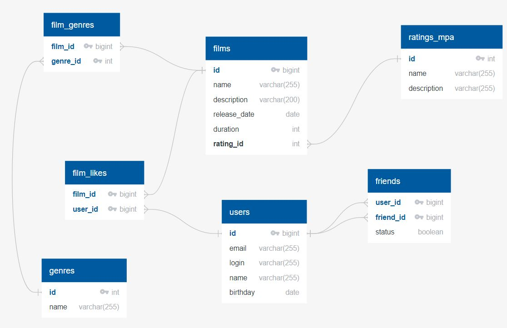

# java-filmorate

## Модель базы данных

---

## Примеры запросов в БД

---

<details>
  <summary>Получить название фильма с id=1</summary>

```sql
    SELECT name
    FROM films
    WHERE film_id = 1;
```

</details>  

<details>
  <summary>Получить всех пользователей с именем 'Андрей'</summary>

```sql
    SELECT *
    FROM users
    WHERE user_name = 'Андрей';
```

</details>
<details>
<summary>Получить количество лайков к фильму '1+1'</summary>

```sql
    SELECT COUNT(fl.user_id)
    FROM film_likes AS fl
    WHERE fl.film_id = (SELECT film_id
        FROM films AS f
        WHERE f.name = '1+1')
    GROUP BY fl.film_id
```
</details>